# Feature Dependencies and Implementation Roadmap

This document summarizes dependencies between features and derives a safe, non-invasive implementation order for hardware and firmware.

## Core prerequisites (must-have before advanced features)

- Safety permit loop: Tank/Water node provides fail-safe WATER_OK; Boiler/Brew nodes gate outputs. Factory microswitch remains primary.
- Boiler/Steam node baseline: SSR in series after pressurestat, watchdog, low-water interlocks, status registers, Modbus.
- Fieldbus and registers: Isolated RS‑485 with the published register map and command TTL/heartbeat.
- Master/UI basic loop: Heartbeat, status read, logging hooks.
- Wi‑Fi provisioning (local-only by default): prerequisite for MQTT/HA and OTA.

## Hardware dependencies (feature → requires)

- Shot timer/counters → brew lever microswitch (present), Boiler/Brew node running.
- Maintenance telemetry → Boiler node status + counters; optional SD/FRAM for persistence.
- Smart warm‑up profiles → Boiler node control + pressure feedback (boiler pressure sensor recommended).
- HX flush coach → Boiler pressure; improved accuracy with grouphead temperature clip.
- Energy modes → Boiler node control; clock/time source (RTC or master).
- Audible/visual cues → Local buzzer/LED or master UI.
- Local-first connectivity → Master/UI + Wi‑Fi provisioning.
- Grouphead temperature clip → physical clip sensor and ADC/1‑Wire input on a node or master.
- Pump current sensing (CT) → CT sensor and ADC input.
- Water quality (TDS) → TDS probe circuitry (diagnostic only).
- Ultrasonic tank level (DYP‑A02YYUW) → 5 V supply, level shifting/isolation, UART/analog input on Tank node.
- Volumetric shot assist → Inline food-safe flowmeter + digital input.
- Brew pressure telemetry → 0–16 bar transducer and T‑fitting.
- Adaptive preinfusion timer → Brew lever microswitch (present) + pump relay control.
- BLE scales (Acaia/Bookoo/Half Decent) → ESP32‑S3 master BLE central + drivers.
- Weight‑triggered timer/ratio/predictive stop → BLE scales; optional flowmeter improves prediction.

## Firmware dependencies (feature → requires)

- Telemetry/logging → register map + master store (SD/FRAM) if persistence needed.
- Warm‑up profiles → boiler control state machine, pressure feedback, feature flags.
- HX flush coach → model + pressure input (+ grouphead temp optional).
- Energy modes → timers/RTC + safe heater gating.
- Volumetric assist → flowmeter ISR/debounce + pump gating logic.
- Brew pressure telemetry → ADC sampling + filtering/logging.
- Adaptive preinfusion → lever debounce + timed pump gating.
- BLE features → BLE manager + vendor drivers + shot logic integration + feature flags.
- Predictive stop → shot logic history + weight/flow inputs + advisory registers.
- MQTT/HA and OTA → Wi‑Fi + signed config/OTA + watchdog/rollback.

## Implementation order (hardware)

1. Read‑only sensing harness: boiler pressure/temperature, lever, tank microswitch (no actuation yet).
2. Tank/Water node and permit loop hardware; verify fail‑safe inhibit on power loss/wire break.
3. Boiler SSR install after pressurestat; maintain mechanical safeties; validate watchdog/brownout.
4. Pump relay after brew lever; verify interlocks with permit and tank low.
5. Optional sensors: grouphead temp clip, brew pressure transducer, flowmeter, CT sensor, ultrasonic tank; SD/FRAM module.
6. Master/UI board with Wi‑Fi/BLE; local UI indicators.

## Implementation order (firmware)

1. Boiler node: safety baseline, interlocks, Modbus, status/counters.
2. Tank node: permit logic, latch semantics, telemetry; integrate with Boiler/Brew nodes.
3. Master/UI: heartbeat, status readout, basic logging; feature flags plumbed.
4. Shot timer/counters (lever‑based), maintenance telemetry; energy idle/standby.
5. HX flush coach v1 (pressure‑only); warm‑up profiles.
6. Connectivity: provisioning, local web/serial console; optional MQTT/HA; OTA (signed, rollback).
7. Sensors: grouphead temp in coach; brew pressure telemetry; pump CT logging.
8. Volumetric assist (flowmeter) and adaptive preinfusion; conservative defaults, opt‑in.
9. BLE scales: drivers + shot logic integration; weight‑triggered timer/ratio; predictive stop advisories.
10. Diagnostics/service tools; trend/fault analytics; UX polish.

## Notes

- Advanced features are opt‑in and never bypass hardwired safeties or the permit loop.
- Guardrails: command TTL, heartbeat, and immutable safety envelopes enforced in nodes.
- Reversibility: all hardware additions use non‑invasive harnesses and adapters.

```mermaid
graph TD
  subgraph Core
    TankNode["Tank/Water Node"]
    PermitLoop["Fail-safe WATER_OK Permit"]
    BoilerNode["Boiler/Steam Node"]
    RS485["Isolated RS-485 Bus"]
    MasterUI["Master/UI (ESP32-S3)"]
    WiFi["Wi‑Fi Provisioning"]
  end

  subgraph Sensors
    GroupheadTemp["Grouphead Temp Clip"]
    BrewPressure["Brew Pressure Transducer"]
    Flowmeter["Flowmeter"]
    PumpCT["Pump CT Sensor"]
    UltrasonicTank["Ultrasonic Tank Level"]
    BLEScales["BLE Scales (Acaia/Bookoo/Half Decent)"]
  end

  subgraph Features
    ShotTimer["Shot Timer & Counters"]
    Telemetry["Telemetry & Logging"]
    Warmup["Smart Warm‑up Profiles"]
    HXCoach["HX Flush Coach"]
    Energy["Energy Modes"]
    Volumetric["Volumetric Shot Assist"]
    Preinfusion["Adaptive Preinfusion"]
    WeightTimer["Weight‑triggered Timer"]
    PredictStop["Predictive Stop (Advisory)"]
    RatioCoach["Brew Ratio Coach"]
    MQTT["MQTT/Home Assistant"]
    OTA["Signed OTA + Rollback"]
  end

  TankNode --> PermitLoop
  PermitLoop --> BoilerNode
  RS485 --> BoilerNode
  RS485 --> TankNode
  RS485 --> MasterUI

  BoilerNode --> ShotTimer
  BoilerNode --> Telemetry
  BoilerNode --> Warmup
  BoilerNode --> HXCoach
  BoilerNode --> Energy

  MasterUI --> Telemetry
  MasterUI --> HXCoach
  MasterUI --> Energy
  MasterUI --> MQTT
  MasterUI --> OTA
  MasterUI --> WeightTimer
  MasterUI --> PredictStop
  MasterUI --> RatioCoach

  WiFi --> MQTT
  WiFi --> OTA

  GroupheadTemp --> HXCoach
  BrewPressure --> Telemetry
  BrewPressure --> HXCoach
  Flowmeter --> Volumetric
  Flowmeter --> PredictStop
  PumpCT --> Telemetry
  PumpCT --> ShotTimer
  UltrasonicTank --> Telemetry
  BLEScales --> WeightTimer
  BLEScales --> PredictStop
  BLEScales --> RatioCoach
```

